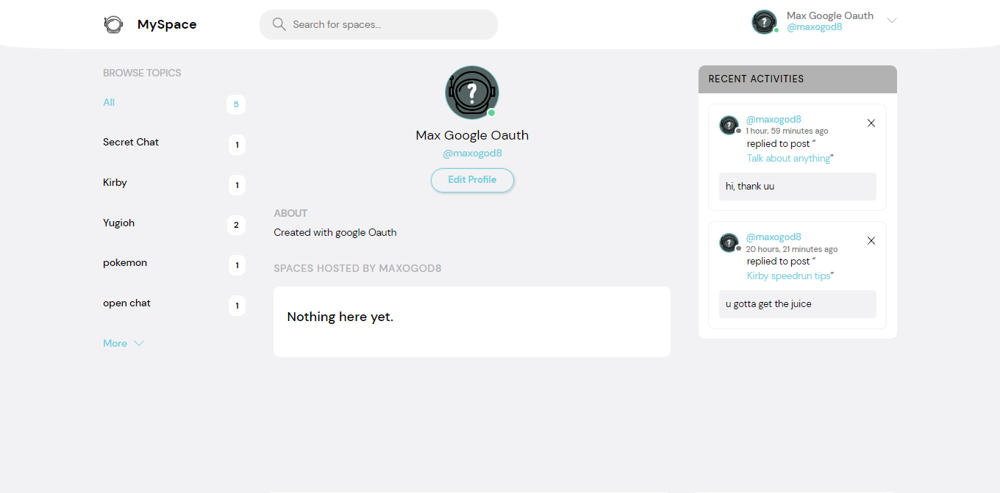

# MySpace

## Django Full-Stack project

This project started from [dennis ivy's](https://www.dennisivy.com/) StudyBud course and was changed and enhanced by me..

Read Features and watch the 4 minute video to see how it works!!

### Video of Website -> <https://www.youtube.com/watch?v=Ck2qWZ7Yrzc>

## How to run

```raw
* Pip install all modules specified in requirements.txt
* set up environment variables to be used in settings.py (DEBUG, SECRET_KEY, ALLOWED_HOSTS)
* run python manage.py runserver
```


## Feautures

### + Log in/Sign up

* You may use an email and password for this, or log in with GOOGLE (google oauth)


### + Edit profile

* You can edit your profile information (picture, name, bio, etc)
* Make it private (nobody can see your information exept your profile picture)



### + See other's profiles and report? them

* A user can be reported for several reasons (messages, username, picture)
* Once a user has been reported 10 times for the same reason their account, messages and spaces will be automatically deleted
* When in someone's profile page you can see all messages they've sent and all spaces they've created (unless it's private)


### + Change Themes

* Switch between light and dark mode


### + Create a space

* Spaces can be created by filling a form with info (Name, Banner, Topic, Private)
* Banners are optional but they make the space seem much more inviting
* All spaces can be seen in the home page sorted by date
* Share your mind, images and videos with everyone in the space
* In private spaces no one who isnt in the participants list can see or say anything, but they can request an invitation which can be accepted or denied by the space's host


### + Edit a space

* Spaces can be edited to change any field such as description, banner, name, etc or even make it private
* Option to completely delete the space

### + Topics

* Each space has one and you are able to filter spaces by them using the search bar or the topics list on the left side of the home page

### + Messages

* All messages can be seen in the home page sorted by creation date
* Option to completely delete the message


### + Rest API

* Api to get data about the state of all rooms or specific ones

### More to find in MySpace

* Run the website and fly through it with your own spaceship!

### Lost?


Click here to see my portfolio -> <https://maxogod.github.io/>

feel free to make pull requests or make suggestions to make the site better
